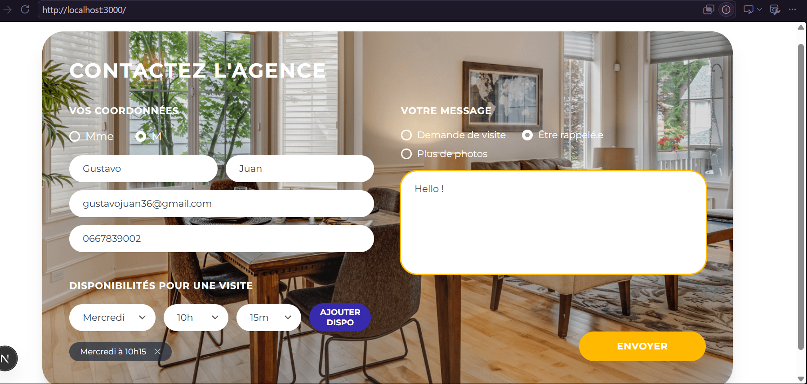
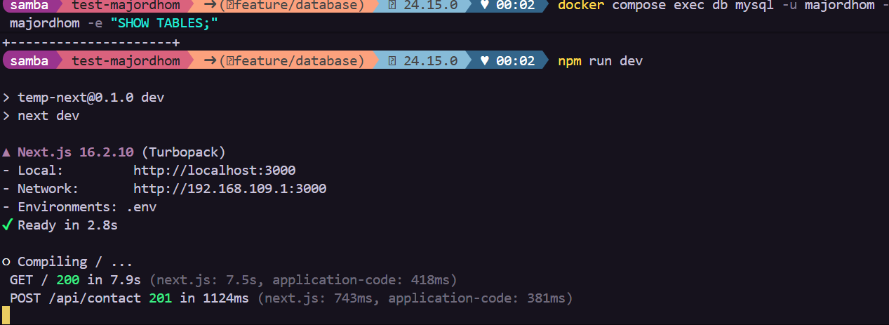

# Test majordhom — Formulaire de contact agence

Intégration fidèle à la maquette d'un formulaire de contact pour une agence immobilière, avec enregistrement des données en base de données.

## Profil

**Samba Diop Gomis**
Bachelor Concepteur Développeur Logiciel Fullstack à La Plateforme, Marseille (depuis novembre 2025)
En recherche d'une alternance de 24 mois à partir de septembre 2026, rythme 4 semaines en entreprise / 1 semaine en école

- Portfolio : https://sdg-portfolio.netlify.app/
- GitHub : https://github.com/samba-gomis
- Email : samba.diop.gomis@gmail.com
- Téléphone : +33 6 29 33 42 16

## Captures d'écran





## Stack technique

| Outil | Rôle | Pourquoi |
|---|---|---|
| **Next.js 16** (App Router) | Frontend + backend | Imposé par le sujet (React ou Next.js) ; les API Routes permettent d'avoir le formulaire et l'endpoint de soumission dans un seul projet, sans backend séparé |
| **React 19** | UI | Fourni avec Next.js |
| **TypeScript** | Typage | Sécurise les échanges entre le formulaire, l'API et les requêtes SQL (évite les erreurs sur les champs requis) |
| **Tailwind CSS v4** | Style | Permet de reproduire rapidement et précisément la maquette (pilules, dégradés, disposition en grille) |
| **MySQL 8.4** | Base de données | Demandé pour la persistance des données du formulaire |
| **mysql2** | Client MySQL (Node) | Client MySQL avec API `promise`, compatible avec les routes async de Next.js et le typage TypeScript |
| **Docker / docker-compose** | Environnement de base de données | Évite d'installer MySQL en local ; la base et son schéma (`database/init.sql`) démarrent avec une seule commande |

## Lancer le projet

```bash
git clone https://github.com/samba-gomis/test-majordhom.git
cd test-majordhom
npm install
cp .env.example .env

# démarre la base MySQL (charge automatiquement database/init.sql)
docker compose up -d

npm run dev
```

Le site est ensuite disponible sur [http://localhost:3000](http://localhost:3000).

## Modèle de données

- `contact` : civilité, nom, prénom, email, téléphone, sujets de la demande (checkboxes), message
- `disponibilite` : jour / heure / minute, liée à un `contact` (une visite peut avoir plusieurs créneaux proposés)

Schéma complet : [database/init.sql](database/init.sql)

## Questions

**Quel a été ton niveau de difficulté sur ce test ?**
Un peu compliqué par moments il a fallu faire de la veille (recherche/documentation) sur certains points, notamment Docker et les API Routes, mais j'y suis arrivé au final.

**As-tu appris de nouveaux outils/technologies pendant cet exercice ?**
Oui, notamment Docker (pour faire tourner MySQL en local) et les API Routes de Next.js.

**Quelle place a le développement web dans ton parcours scolaire ?**
Je fais du développement tout au long de mon parcours scolaire, c'est une part centrale de ma formation.

**As-tu utilisé l'IA dans ton processus de travail ? Comment ?**
Oui, j'utilise l'IA pour me documenter et progresser sur certaines compétences (débogage, découverte d'outils comme Docker, bonnes pratiques).
